# Dealer-Sourcing: Phase 3 → Production Roadmap

**Status**: Mapeamento de Agentes e Sequência
**Data**: 2026-03-28
**Objetivo**: Definir sequência exata de agentes até projeto rodando em produção (fora do localhost)

---

## 🎯 Sequência Completa de Fases

```
localhost ✅ → Database Schema → Backend Impl → QA → Production Deploy
```

---

## 📋 PHASE 3: Database Architecture & Schema Design

**Agente**: `@data-engineer` (Dara - The Sage)

### Tasks Sequenciais

| # | Task | Command | Output | Bloqueador |
|----|------|---------|--------|-----------|
| 1 | Model Domain Interactively | `*model-domain` | Domain diagram + table definitions | None |
| 2 | Design Index Strategy | (durante model-domain) | Index recommendations | Task 1 |
| 3 | Design RLS Policies | (durante model-domain) | RLS policy templates | Task 1 |
| 4 | Create Migration Script | `*apply-migration` | 001_initial_schema.sql | Task 1-3 |
| 5 | Dry-run Migration | `*dry-run migrations/001_*` | Validation report | Task 4 |
| 6 | Apply Migration (Local) | `*apply-migration migrations/001_*` | Schema created in local DB | Task 5 |
| 7 | Create Seed Data | `*seed migrations/seed_*` | Initial data loaded | Task 6 |
| 8 | Smoke Test Database | `*smoke-test` | DB connectivity + queries validated | Task 7 |

### Deliverables
- ✅ PostgreSQL schema (interested_vehicles, vehicles_cache, search_queries)
- ✅ Migration scripts (SQL files in `db/migrations/`)
- ✅ RLS policies (security)
- ✅ Index strategy (performance)
- ✅ Seed data script
- ✅ Documentation (schema-design.md)

### Dependencies
- ✅ PostgreSQL local (Docker or native)
- ✅ DATABASE_URL configured locally

---

## ✅ PHASE 4: Backend Implementation (Persistence Layer) - COMPLETE

**Agente**: `@dev` (Dex - The Builder)
**Status**: 🟢 READY FOR QA

### Tasks Completadas

| # | Task | Story | Output | Status |
|----|------|-------|--------|--------|
| 1 | Implement POST /interested | STORY-401 | Persistência com ON CONFLICT | ✅ |
| 2 | Implement GET /favorites | STORY-402 | RLS isolation + pagination | ✅ |
| 3 | Implement GET /search | STORY-403 | Filtros (make, model, price) | ✅ |
| 4 | Implement GET /list | STORY-404 | Paginação (limit/offset) | ✅ |
| 5 | Implement GET /:id | STORY-405 | Vehicle details | ✅ |
| 6 | Integration Tests | STORY-406 | 40 comprehensive tests | ✅ |
| 7 | Input Validation | (integrated) | All parameters validated | ✅ |
| 8 | Error Handling | (integrated) | 400, 404, 409, 500 responses | ✅ |

### Deliverables Completados
- ✅ POST /sourcing/:id/interested (saves to interested_vehicles with ACID transactions)
- ✅ GET /sourcing/favorites (reads with RLS user isolation)
- ✅ GET /sourcing/search (with filters + pagination)
- ✅ GET /sourcing/list (with pagination + sorting)
- ✅ GET /sourcing/:id (vehicle details)
- ✅ Database connection pool (max 20 connections)
- ✅ Input validation utilities (type, range, length checks)
- ✅ Error handling (all HTTP codes)
- ✅ Pagination support (limit 1-100, offset)
- ✅ Integration test suite (40 tests, Jest + supertest)
- ✅ Server configuration updated (all routes registered)
- ✅ Database configuration updated (.env DATABASE_URL)

### Artifacts
- ✅ `src/routes/sourcing.js` (293 lines)
- ✅ `src/server.js` (updated with all routes)
- ✅ `src/config/database.js` (pooling + connection)
- ✅ `test/integration/sourcing.test.js` (40 tests)
- ✅ `jest.config.js` (ESM configuration)
- ✅ `PHASE-4-DELIVERY.md` (detailed documentation)
- ✅ `TEST_SETUP.md` (testing infrastructure)

### Dependencies Completadas
- ✅ Phase 3 complete (schema + migrations applied)
- ✅ PostgreSQL schema exists (5 tables, RLS policies, triggers, indices)
- ✅ .env with DATABASE_URL configured
- ✅ Node.js dependencies installed (pg, express, supertest, jest)

---

## 📋 PHASE 5: Quality Assurance & Validation

**Agente**: `@qa` (Quinn - The Validator)

### Tasks Sequenciais

| # | Task | Type | Output | Bloqueador |
|----|------|------|--------|-----------|
| 1 | Create Test Suite | `*create-suite dealer-sourcing` | Test structure + runners | Phase 4 ✅ |
| 2 | Test Data Persistence | `*test-story STORY-201` | Verify interested_vehicles works | Task 1 |
| 3 | Test Pagination | `*test-story STORY-207` | Verify limit/offset works | Task 1 |
| 4 | Test Auth + RLS | `*security-audit` | Verify user isolation via RLS | Task 1 |
| 5 | Regression Tests | `*run-suite full` | All endpoints tested | Task 2-4 |
| 6 | Load Testing | `*load-test 100rps` | Performance baseline | Task 5 |
| 7 | Security Scan | `npm audit` | Dependency vulnerabilities | Task 1 |
| 8 | Code Review | `*review-pr` | CodeRabbit scan | Task 5 |

### Deliverables
- ✅ Test suite (Jest/Mocha)
- ✅ 80%+ code coverage
- ✅ All tests passing
- ✅ No security vulnerabilities
- ✅ Performance baseline documented
- ✅ CodeRabbit approval

### Dependencies
- ✅ Phase 4 complete (backend implementation)
- ✅ Database running

---

## 📋 PHASE 6: Infrastructure & Production Deployment

**Agente**: `@devops` (Gage - Operator)

### Tasks Sequenciais

| # | Task | Command | Output | Bloqueador |
|----|------|---------|--------|-----------|
| 1 | Setup Render PostgreSQL | `*setup-database render` | PostgreSQL addon created | Phase 5 ✅ |
| 2 | Configure Render Env Vars | Edit render.yaml | DATABASE_URL set | Task 1 |
| 3 | Create Migration CI Step | Modify .github/workflows | Migrations run before deploy | Task 2 |
| 4 | Update render.yaml | Edit deploy config | buildCommand runs migrations | Task 3 |
| 5 | Deploy Backend to Render | `@devops *push` | Code pushed + deployed | Task 1-4 |
| 6 | Run Production Migrations | Manual trigger or auto | Schema applied to prod DB | Task 5 |
| 7 | Smoke Test Production | `*smoke-test prod` | Health checks pass | Task 6 |
| 8 | Setup Monitoring | Add Sentry/LogRocket | Error tracking enabled | Task 7 |

### Deliverables
- ✅ PostgreSQL instance on Render
- ✅ DATABASE_URL configured
- ✅ CI/CD pipeline includes migrations
- ✅ Backend deployed to Render
- ✅ Database schema in production
- ✅ Monitoring configured
- ✅ Health check endpoint working

### Dependencies
- ✅ Phase 5 complete (tests passing)
- ✅ Render account configured
- ✅ GitHub Actions working

---

## 📋 PHASE 7: Real Data Integration (Optional - For Production Realism)

**Agente**: `@architect` (Aria - Visionary) + `@dev` (Dex - Builder)

### Tasks Sequenciais

| # | Task | Type | Output | Bloqueador |
|----|------|------|--------|-----------|
| 1 | Design Scraping Strategy | `*propose-architecture` | Puppeteer vs API decision | Phase 6 ✅ |
| 2 | Implement OLX Scraper | `*develop STORY-301` | Real vehicle data | Task 1 |
| 3 | Implement Fallback Logic | `*develop STORY-302` | Mock data when scraper fails | Task 2 |
| 4 | Setup Scheduler | `*develop STORY-303` | Cron job to refresh data daily | Task 2 |
| 5 | Test Real Data Ingestion | `*test-story STORY-301` | Real data flowing through system | Task 4 |
| 6 | Deploy Updated Backend | `@devops *push` | Real scrapers live | Task 5 |

### Deliverables
- ✅ Puppeteer scraper for OLX
- ✅ Real vehicle data in database
- ✅ Fallback to mock data on error
- ✅ Daily refresh job running
- ✅ Tests passing
- ✅ Deployed to production

### Dependencies
- ✅ Phase 6 complete (backend in production)
- ✅ Database working in prod

---

## 🔗 Agent Handoff Sequence

```mermaid
flowchart LR
    DEV_LOCAL["Local Dev<br/>(localhost)"]

    DEV_LOCAL -->|"Phase 3"|DATA["@data-engineer<br/>DB Schema"]
    DATA -->|"schema.sql<br/>migrations/"| IMPL["@dev<br/>Backend Impl"]
    IMPL -->|"src/routes<br/>src/server.js"|QA["@qa<br/>Testing"]
    QA -->|"test suite<br/>passing tests"|OPS["@devops<br/>Deploy"]
    OPS -->|"git push<br/>Render"|PROD["🚀 Production<br/>(Render)"]

    PROD -.->|"Phase 7 (optional)"|REAL["@architect<br/>Real Data"]
    REAL -->|"scrapers"|PROD

    style DATA fill:#e3f2fd
    style IMPL fill:#e8f5e9
    style QA fill:#fce4ec
    style OPS fill:#fff3e0
    style REAL fill:#f3e5f5
    style PROD fill:#c8e6c9
```



---

## ✅ Checklist: Prerequisites (Before Starting Phase 3)

- [ ] PostgreSQL 14+ installed locally (Docker or native)
- [ ] `.env` file with DATABASE_URL pointing to local DB
- [ ] `npm install` completed
- [ ] Backend running locally (`npm start`)
- [ ] JWT_SECRET configured
- [ ] Architecture doc reviewed (architecture-dealer-sourcing.md)

---

## ⏱️ Estimated Timeline

| Phase | Agent | Duration | Status |
|-------|-------|----------|--------|
| 3 | @data-engineer | 2-4h | Ready |
| 4 | @dev | 4-8h | Ready |
| 5 | @qa | 2-4h | Ready |
| 6 | @devops | 1-2h | Ready |
| 7 | @architect + @dev | 4-6h | Optional |
| **TOTAL** | 5 agents | **13-24h** | **Ready to Start** |

---

## 🎬 How to Proceed

**Step 1**: Review this roadmap (you are here)

**Step 2**: When ready, activate Phase 3:
```
/@data-engineer
*model-domain
```

**Step 3**: I'll notify you when @data-engineer finishes with outputs

**Step 4**: Next agent (@dev) takes over based on Phase 3 deliverables

**Continue**: Until production is live ✅

---

## 📌 Key Success Metrics

- [ ] Phase 3: Schema passes validation + migrations are idempotent
- [ ] Phase 4: All 8 tests passing locally with PostgreSQL
- [ ] Phase 5: 80%+ code coverage + no security vulnerabilities
- [ ] Phase 6: Backend live on Render + database connected + health check passing
- [ ] Phase 7: Real vehicle data ingesting daily

---

*Roadmap prepared by @aios-master*
